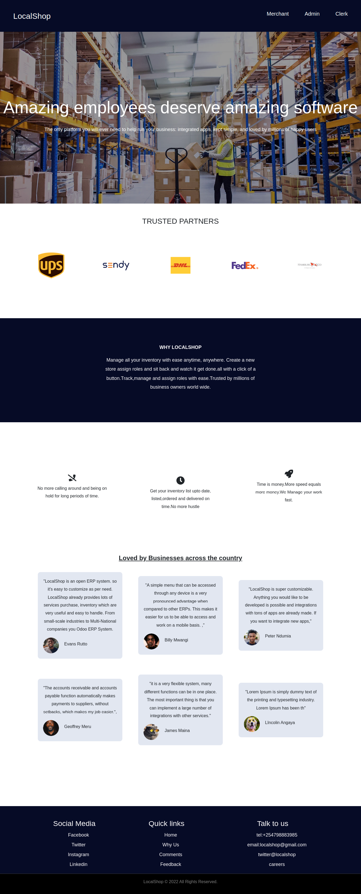

# LocalShop Inventory Management Application
- version 1.0.0

# Authors
- Geoffrey Njihia- Scrum Master
- Billy Mwangi
- Dancun Oluoch
- Peter Ndumia
- Evans Rutto
- Lincolin Angaya

## Description

This is an inventory app that can help in stock taking, generation and visualization of weekly, monthly and annual reports.

## Livelink:


## screenshot:



## About Localshop

- Authentication - Only the superuser(This could be the merchant) can initialize the registration process to add an admin by sending a tokenized link to their email from which the invitee can register within a reasonable amount of time.

- The admins upon registration are responsible for adding data entry clerks
A dashboard where clerks can record details for the received items in the store:
The number of items received
- The status of payment(paid or not paid), this is important for procurement processes.
The number of items in stock.
The number of items spoilt( Broken, expired and anything else).
Buying and selling price.
On the same dashboard there should be an option to request for more product supply - this request goes to the store admin
The store admin can be able:
To see a detailed report on the performance of individual entries.
To approve or decline supply requests from the clerk.
To see the products that suppliers have been paid and those not yet - this should be well separated to ensure ease of viewing.
To change the payment status to paid for the products that were not paid - Ideally this happens after the suppliers have been paid.
To inactivate or delete a clerks account and as well add new clerks.
As above mentioned the report should be in a good graphical representation; that is, linear graphs and bar graphs as a requirement - pie charts are totally optional.
- The merchant can be able to:
Add an admin, deactivate and delete their accounts - PS deactivation is independent from deleting the account, it is important for probation purposes.
- Should be able to see a store by store report in well visualized graphs
To see an individual store performance, even narrowing down to individual product performance.
To see the paid and non paid products for each store.

## Technologies used
- Figma- Wireframes
- ReactJS and Redux Toolkit-Frontend
- CSS-styling
- Ruby on Rails- Backend
- Postgresql- Database
- Jest & Minitests: Testing frameworks
- Ruby 2.7.4
- NodeJS (v16), and npm
- Heroku CLI
- Postgresql


## Environment Setup

- Start by **cloning**  the project template into your repository.

- open the directory containing the project localshop

- run command 
`code .` 
to open the project in your IDE(code editor)

- open terminal in your code editor and run the command
 ``` npm start --prefix client```
 to start the client front-end


-  run command
  ```rails s```
  to open the backend server 


## Known Bugs

- No known bugs as of know :) .

## Support and contact details

If you have any suggestion or contributions about this project, you can reach out to the team that collaborated in making the project a success:
- Geoffrey Njihia: geoffreynjihia15@gmail.com
- Duncan Oluoch: oluochdancun19@gmail.com
- Peter Ndumia: ndegwandumia@gmail.com
- Billy Mwangi : kibuchibp@gmail.com
- Lincoln Angaya: lincolinangaya5626@gmail.com
- Evans Rutto: robbyevans001@gmail.com

## License
- Copyright 2022 Team LocalShop
- Permission is hereby granted, free of charge, to any person obtaining a copy of this software and associated documentation files (the "Software"), to deal in the Software without restriction, including without limitation the rights to use, copy, modify, merge, publish, distribute, sublicense, and/or sell copies of the Software, and to permit persons to whom the Software is furnished to do so, subject to the following conditions:
- The above copyright notice and this permission notice shall be included in all copies or substantial portions of the Software.
- THE SOFTWARE IS PROVIDED "AS IS", WITHOUT WARRANTY OF ANY KIND, EXPRESS OR IMPLIED, INCLUDING BUT NOT LIMITED TO THE WARRANTIES OF MERCHANTABILITY, FITNESS FOR A PARTICULAR PURPOSE AND NONINFRINGEMENT. IN NO EVENT SHALL THE AUTHORS OR COPYRIGHT HOLDERS BE
LIABLE FOR ANY CLAIM, DAMAGES OR OTHER LIABILITY, WHETHER IN AN ACTION OF CONTRACT, TORT OR OTHERWISE, ARISING FROM, OUT OF OR IN CONNECTION WITH THE SOFTWARE OR THE USE OR OTHER DEALINGS IN THE SOFTWARE.


